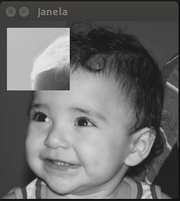
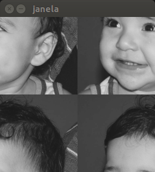
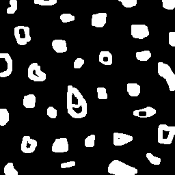
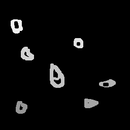
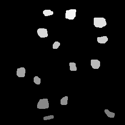
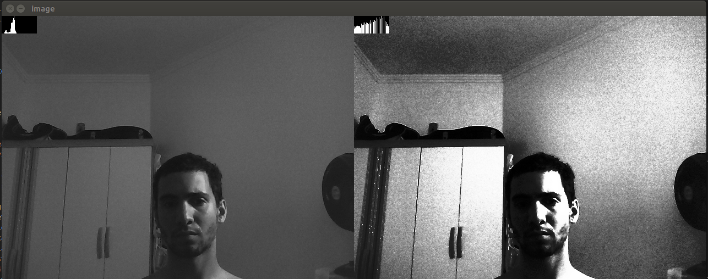
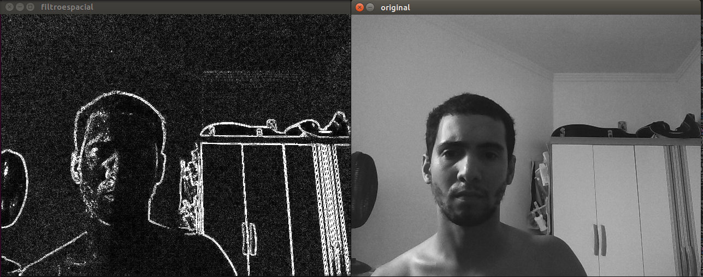

# Processamento Digital de Imagens

Esta página contém os códigos desenvolvidos para a disciplinda de PDI (2018.1)

## Seção 2 - Exercícios
### Questão 1

Este programa tem a função de selecionar uma determinada região e trocar os tons de cinza de forma que a região selecionada será o inverso da imagem real.
Arquivo regions.cpp



```cpp
#include <iostream>
#include <opencv2/opencv.hpp>

using namespace cv;
using namespace std;

int main(int argc, char** argv){
  Mat image;

  if (argc < 5) {
    cout << "Quatro argumentos numéricos são necessários" << endl;
    return 0;
  }

  int ax = atoi(argv[1]);
  int ay = atoi(argv[2]);
  int bx = atoi(argv[3]);
  int by = atoi(argv[4]);

  image = imread("biel.png",CV_LOAD_IMAGE_GRAYSCALE);
  if(!image.data)
    cout << "nao abriu biel.png" << endl;

  namedWindow("janela",WINDOW_AUTOSIZE);

  if (ax > 0 && ay > 0 && bx < image.rows && by < image.cols){
    for(int i=ax;i<bx;i++){
      for(int j=ay;j<by;j++){
        image.at<uchar>(i,j)= 255 - image.at<uchar>(i,j);
      }
    }
  }
  else{
    cout << "Argumentos devem ser de pontos dentro da imagem";
  }

  imshow("janela", image);  
  waitKey();

  return 0;
}

```

### Questão 2

Esse programa tem a simples função de trocar os quadrantes da imagem, gerando uma imagem embaralhada de acordo com a imagem de input.

Arquivo trocarregioes.cpp



```cpp
#include <iostream>
#include <opencv2/opencv.hpp>

using namespace cv;
using namespace std;

int main(int, char**){
  Mat image;

  image= imread("biel.png",CV_LOAD_IMAGE_GRAYSCALE);
  if(!image.data)
    cout << "nao abriu bolhas.png" << endl;

  namedWindow("janela",WINDOW_AUTOSIZE);

  for(int i=0; i<image.rows/2; i++){
    for(int j=0; j<image.cols/2; j++){
      uchar aux = image.at<uchar>(i,j);
      image.at<uchar>(i,j)=image.at<uchar>(image.rows/2 + i, image.cols/2 + j);
      image.at<uchar>(image.rows/2 + i, image.cols/2 + j) = aux;
    }
  }

  for(int i=0; i<image.rows/2; i++){
    for(int j=image.cols/2; j<image.cols; j++){
      uchar aux = image.at<uchar>(i,j);
      image.at<uchar>(i,j)=image.at<uchar>(image.rows/2 + i, j - image.cols/2);
      image.at<uchar>(image.rows/2 + i, j - image.cols/2) = aux;
    }
  }
  
  imshow("janela", image);  
  waitKey();

  return 0;
}

```

## Seçãoo 3 - Exercícios

### Questão 1 

Caso existem mais de 255 objetos para identificar na imagem, ocorrerá erro pois a forma de identificação que estamos utilizado é de colorir em tons de cinza que vão de 1 a 254 os objetos encontrados. Dessa forma é possível reconhecer individualmente cada objeto. Porém, se quisermos identificar mais de 255 objetos, podemos utlizar uma representação em ponto flutuante, para assim termos um número muito maior de possibilidades. Nesse caso, será dificil de visualizar a imagem gerada, mas o computador poderá identificar os objetos encontrados.

### Questão 2

Esse programa foi desenvolvido para identificar regiões com e sem buracos. O resultado final é que, dado uma imagem de input, ele irá criar uma imagem que contém todas as regiões sem buracos numeradas de forma única (usando a coloração em tons de cinza) e uma outra imagem que contém todas as regiões com buraco (um ou mais buracos) numeradas em coloração de tons de cinza também.

Arquivo labellingHoles.cpp





```cpp
#include <iostream>
#include <opencv2/opencv.hpp>

using namespace cv;
using namespace std;

int main(int argc, char** argv){
  Mat image, imgholes, imgregions, imgaux;
  int width, height;
  int nobjects;
  
  CvPoint p;
  image = imread(argv[1],CV_LOAD_IMAGE_GRAYSCALE);
  
  if(!image.data){
    std::cout << "imagem nao carregou corretamente\n";
    return(-1);
  }
  width=image.cols;
  height=image.rows;

  p.x=0;
  p.y=0;

  // Elimina elementos que tocam as bordas superior e inferior
  for(int i=0; i<height; i=i+height-1){
    for(int j=0; j<width; j++){
      if(image.at<uchar>(i,j) == 255){
        p.x=j;
        p.y=i;
        floodFill(image,p,0);
      }
	  }
  }

  // Elimina elementos que tocam as bordas laterais
  for(int i=0; i<height; i++){
    for(int j=0; j<width; j = j+width-1){
      if(image.at<uchar>(i,j) == 255){
        p.x=j;
        p.y=i;
        floodFill(image,p,0);
      }
	  }
  }

  image.copyTo(imgholes);
  image.copyTo(imgregions);
  image.copyTo(imgaux);

  // Preenche background com fundo branco
  p.x=0;
  p.y=0;
  floodFill(imgaux,p,255);

  // HOLES DETECTION
  // detectar pontos pretos em uma imagem e preencher com identificador o pixel (anterior)
  // da outra imagem
  nobjects=255; // inicia em 255 para facilitar visualização
  for(int i=0; i<height; i++){
    for(int j=0; j<width; j++){
      if(imgaux.at<uchar>(i,j) == 0){
        // achou uma região preta
        if(imgholes.at<uchar>(i,j-1) == 255){
          nobjects -= 15; // diminui 15 para facilitar visualização
          p.x=j-1;
          p.y=i;
          floodFill(imgholes,p,nobjects);
        }        
      }
	  }
  }

  for(int i=0; i<height; i++){
    for(int j=0; j<width; j++){
      if(imgholes.at<uchar>(i,j) == 255){
        p.x=j;
        p.y=i;
        floodFill(imgholes,p,0);
      }
    }
  }

  // REGIONS WITHOUT HOLES DETECTION

  nobjects=255;
  for(int i=0; i<height; i++){
    for(int j=0; j<width; j++){
      if(imgholes.at<uchar>(i,j) != 255 && imgholes.at<uchar>(i,j) != 0 && imgregions.at<uchar>(i,j) == 255){
         // diminui 15 para facilitar visualização
        p.x=j;
        p.y=i;
        floodFill(imgregions,p,0);
      }
      if(imgregions.at<uchar>(i,j) == 255){
        nobjects -= 10;
        p.x=j;
        p.y=i;
        floodFill(imgregions,p,nobjects);
      }
    }
  }

  imwrite("labelingHolesRegions.png", imgregions);
  imwrite("labelingHolesDetected.png", imgholes);
  waitKey();
  return 0;
}
```
## Seçãoo 3 - Exercícios

### Questão 1

Este program tem a função de capturar frames do video da webcam e gerar duas imagens.  A primeira imagem é o frame original e a segunda imagem é o frame com histograma equalizado pela função do OpenCV. A gente percebe que o histograma equalizado permite a melhor visualização de cores, especialmente em ambientes muito claros ou muito escuros onde o histograma original tinha valores muito concentrados em uma única região.

Arquivo equalize.cpp



```cpp
#include <iostream>
#include <opencv2/opencv.hpp>

using namespace cv;
using namespace std;

int main(int argc, char** argv){
  Mat image, grey_image, eq_image, dst_image;
  int width, height;
  VideoCapture cap;
  vector<Mat> planes;
  Mat histR, histG; //, histB;
  int nbins = 64;
  float range[] = {0, 256};
  const float *histrange = { range };
  bool uniform = true;
  bool acummulate = false;

  cap.open(0);
  
  if(!cap.isOpened()){
    cout << "cameras indisponiveis";
    return -1;
  }
  
  width  = cap.get(CV_CAP_PROP_FRAME_WIDTH);
  height = cap.get(CV_CAP_PROP_FRAME_HEIGHT);

  cout << "largura = " << width << endl;
  cout << "altura  = " << height << endl;

  int histw = nbins, histh = nbins/2;
  Mat histImgR(histh, histw, CV_8UC1, Scalar(0)); // modificado para criar um histograma em greyscale
  Mat histImgG(histh, histw, CV_8UC1, Scalar(0));

  //Mat histImgR(histh, histw, CV_8UC3, Scalar(0,0,0));
  //Mat histImgG(histh, histw, CV_8UC3, Scalar(0,0,0));
  //Mat histImgB(histh, histw, CV_8UC3, Scalar(0,0,0));

  while(1){
    cap >> image;

    cvtColor(image, grey_image, cv::COLOR_BGR2GRAY);
    // Apply Histogram Equalization
    equalizeHist(grey_image, eq_image);
    
    //split(image, planes);

    calcHist(&grey_image, 1, 0, Mat(), histR, 1,
             &nbins, &histrange,
             uniform, acummulate);
    calcHist(&eq_image, 1, 0, Mat(), histG, 1,
             &nbins, &histrange,
             uniform, acummulate);

    // calcHist(&planes[0], 1, 0, Mat(), histR, 1,
    //          &nbins, &histrange,
    //          uniform, acummulate);
    // calcHist(&planes[1], 1, 0, Mat(), histG, 1,
    //          &nbins, &histrange,
    //          uniform, acummulate);
    // calcHist(&planes[2], 1, 0, Mat(), histB, 1,
    //          &nbins, &histrange,
    //          uniform, acummulate);

    normalize(histR, histR, 0, histImgR.rows, NORM_MINMAX, -1, Mat());
    normalize(histG, histG, 0, histImgG.rows, NORM_MINMAX, -1, Mat());
    // normalize(histB, histB, 0, histImgB.rows, NORM_MINMAX, -1, Mat());

    histImgR.setTo(Scalar(0));
    histImgG.setTo(Scalar(0));
    // histImgB.setTo(Scalar(0));
    
    for(int i=0; i<nbins; i++){
      line(histImgR,
           Point(i, histh),
           Point(i, histh-cvRound(histR.at<float>(i))),
           Scalar(255), 1, 8, 0);
      line(histImgG,
           Point(i, histh),
           Point(i, histh-cvRound(histG.at<float>(i))),
           Scalar(255), 1, 8, 0);
      // line(histImgB,
      //      Point(i, histh),
      //      Point(i, histh-cvRound(histB.at<float>(i))),
      //      Scalar(255, 0, 0), 1, 8, 0);
    }
    histImgR.copyTo(grey_image(Rect(0, 0 ,nbins, histh)));
    histImgG.copyTo(eq_image(Rect(0, 0 ,nbins, histh)));
    // histImgB.copyTo(image(Rect(0, 2*histh ,nbins, histh)));

    hconcat(grey_image, eq_image, dst_image);

    imshow("image", dst_image);
    if(waitKey(30) >= 0) break;
  }
  return 0;
}
```

### Questão 2

Arquivo motiondetection.cpp

Este programa de motion detection utiliza o histograma como ferramenta para reconhecer movimentos na tela. Isso é possível pois o histograma deve sofre uma variação notável em sua correlação com cada frame anterior ao movimento. Assim é possivel identificar e sinalizar o movimento quando acontece.

```cpp
#include <iostream>
#include <stdlib.h>
#include <opencv2/opencv.hpp>

using namespace cv;
using namespace std;

int main(int argc, char** argv){
  Mat image, grey_image, eq_image, dst_image;
  int width, height;
  VideoCapture cap;
  vector<Mat> planes;
  Mat histR, old_hist; //, histB;
  int nbins = 64;
  float range[] = {0, 256};
  const float *histrange = { range };
  bool uniform = true;
  bool acummulate = false;

  cap.open(0);
  
  if(!cap.isOpened()){
    cout << "cameras indisponiveis";
    return -1;
  }
  
  width  = cap.get(CV_CAP_PROP_FRAME_WIDTH);
  height = cap.get(CV_CAP_PROP_FRAME_HEIGHT);

  cout << "largura = " << width << endl;
  cout << "altura  = " << height << endl;

  int histw = nbins, histh = nbins/2;
  Mat histImgR(histh, histw, CV_8UC1, Scalar(0)); // modificado para criar um histograma em greyscale

  // // faz uma vez para poder, calcular a primeira correlação, dar continuidade dentro do loop
  cap >> image;
  cvtColor(image, grey_image, cv::COLOR_BGR2GRAY);
  calcHist(&grey_image, 1, 0, Mat(), histR, 1,
             &nbins, &histrange,
             uniform, acummulate);
  normalize(histR, histR, 0, histImgR.rows, NORM_MINMAX, -1, Mat());
  
  histR.copyTo(old_hist);

  while(1){
    cap >> image;

    cvtColor(image, grey_image, cv::COLOR_BGR2GRAY);

    calcHist(&grey_image, 1, 0, Mat(), histR, 1,
             &nbins, &histrange,
             uniform, acummulate);

    normalize(histR, histR, 0, histImgR.rows, NORM_MINMAX, -1, Mat());

    float sum = 0, sqrtold = 0, sqrtnew = 0;

    double d = compareHist(histR,old_hist,CV_COMP_CORREL);
    cout << d << endl;

    if ( d < 0.99)
    {
      cout << "Moviemnto detectado";
    }

    histR.copyTo(old_hist);

    histImgR.setTo(Scalar(0));
    
    for(int i=0; i<nbins; i++){
      line(histImgR,
           Point(i, histh),
           Point(i, histh-cvRound(histR.at<float>(i))),
           Scalar(255), 1, 8, 0);
    }
    histImgR.copyTo(grey_image(Rect(0, 0 ,nbins, histh)));

    imshow("image", grey_image);
    if(waitKey(30) >= 0) break;
  }
  return 0;
}

```

## Seção 5 - Exercícios

### Questão 1

Este programa implementa uma nova função ao programa do exemplo explicado nessa seção do tutorial. Agora é implementado o laplaciano do gaussino e por isso foi preciso recalcular a matriz kernel do filtro e alterar o programa para que ele fosse implementado com essa nova função. Vemos que o laplaciano do gaussiano permite uma melhor identficação das bordas.



```cpp
#include <iostream>
#include <opencv2/opencv.hpp>

using namespace cv;
using namespace std;

void printmask(Mat &m){
  for(int i=0; i<m.size().height; i++){
    for(int j=0; j<m.size().width; j++){
      cout << m.at<float>(i,j) << ",";
    }
    cout << endl;
  }
}

void menu(){
  cout << "\npressione a tecla para ativar o filtro: \n"
	"a - calcular modulo\n"
    "m - media\n"
    "g - gauss\n"
    "v - vertical\n"
	  "h - horizontal\n"
    "l - laplaciano\n"
    "y - laplaciano do gaussiano\n"
	  "esc - sair\n";
}

int main(int argvc, char** argv){
  VideoCapture video;
  float media[] = {1,1,1,
				   1,1,1,
				   1,1,1};
  float gauss[] = {1,2,1,
				   2,4,2,
				   1,2,1};
  float horizontal[]={-1,0,1,
					  -2,0,2,
					  -1,0,1};
  float vertical[]={-1,-2,-1,
					0,0,0,
					1,2,1};
  float laplacian[]={0,-1,0,
					 -1,4,-1,
					 0,-1,0};
  float laplaciangauss[]={0,0,1,0,0,
  					0,1,2,1,0,
  					1,2,-16,2,1,
  					0,1,2,1,0,
  					0,0,1,0,0};

  Mat cap, frame, frame32f, frameFiltered;
  Mat mask(3,3,CV_32F), mask1;
  Mat result, result1;
  double width, height, min, max;
  int absolut;
  char key;
  
  video.open(0); 
  if(!video.isOpened()) 
    return -1;
  width=video.get(CV_CAP_PROP_FRAME_WIDTH);
  height=video.get(CV_CAP_PROP_FRAME_HEIGHT);
  std::cout << "largura=" << width << "\n";;
  std::cout << "altura =" << height<< "\n";;

  namedWindow("filtroespacial",1);

  mask = Mat(3, 3, CV_32F, media); 
  scaleAdd(mask, 1/9.0, Mat::zeros(3,3,CV_32F), mask1);
  swap(mask, mask1);
  absolut=1; // calcs abs of the image

  menu();
  for(;;){
    video >> cap; 
    cvtColor(cap, frame, CV_BGR2GRAY);
    flip(frame, frame, 1);
    imshow("original", frame);
    frame.convertTo(frame32f, CV_32F);
    filter2D(frame32f, frameFiltered, frame32f.depth(), mask, Point(1,1), 0);
    if(absolut){
      frameFiltered=abs(frameFiltered);
    }
    frameFiltered.convertTo(result, CV_8U);
    imshow("filtroespacial", result);
    key = (char) waitKey(10);
    if( key == 27 ) break; // esc pressed!
    switch(key){
    case 'a':
	  menu();
      absolut=!absolut;
      break;
    case 'm':
	  menu();
      mask = Mat(3, 3, CV_32F, media);
      scaleAdd(mask, 1/9.0, Mat::zeros(3,3,CV_32F), mask1);
      mask = mask1;
      printmask(mask);
      break;
    case 'g':
	  menu();
      mask = Mat(3, 3, CV_32F, gauss);
      scaleAdd(mask, 1/16.0, Mat::zeros(3,3,CV_32F), mask1);
      mask = mask1;
      printmask(mask);
      break;
    case 'h':
	  menu();
      mask = Mat(3, 3, CV_32F, horizontal);
      printmask(mask);
      break;
    case 'v':
	  menu();
      mask = Mat(3, 3, CV_32F, vertical);
      printmask(mask);
      break;
    case 'l':
	  menu();
      mask = Mat(3, 3, CV_32F, laplacian);
      printmask(mask);
      break;
    case 'y':
	  menu();
      mask = Mat(5, 5, CV_32F, laplaciangauss);
      printmask(mask);
      break;
    default:
      break;
    }
  }
  return 0;
}


```
